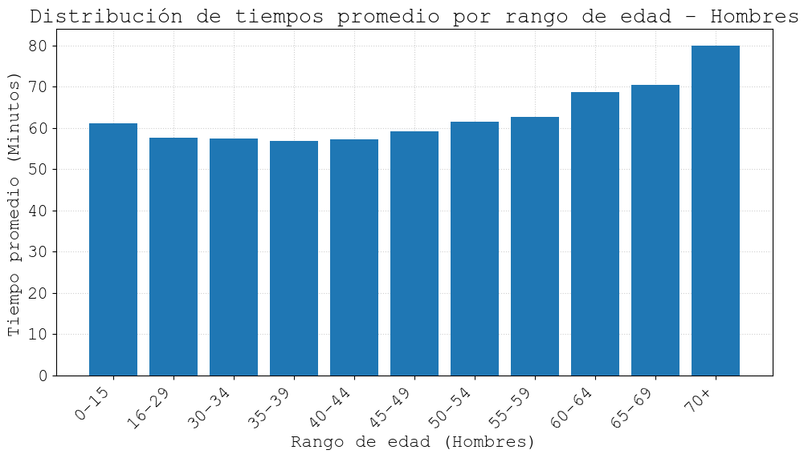
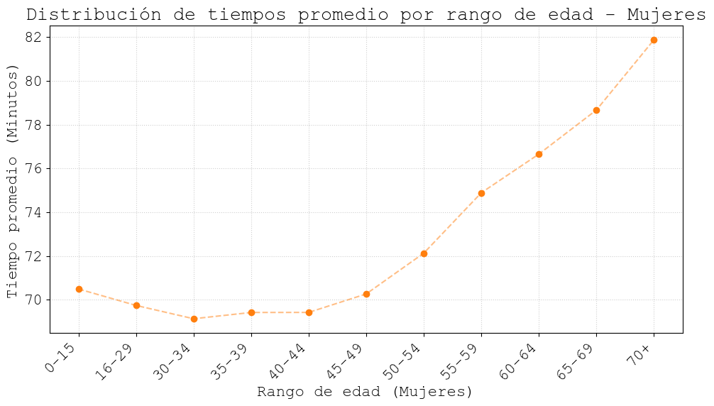
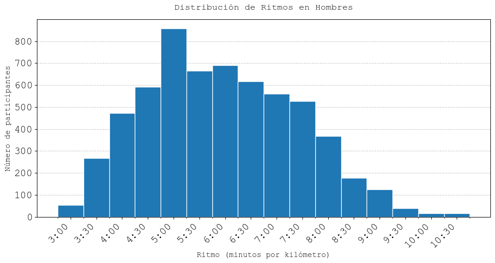
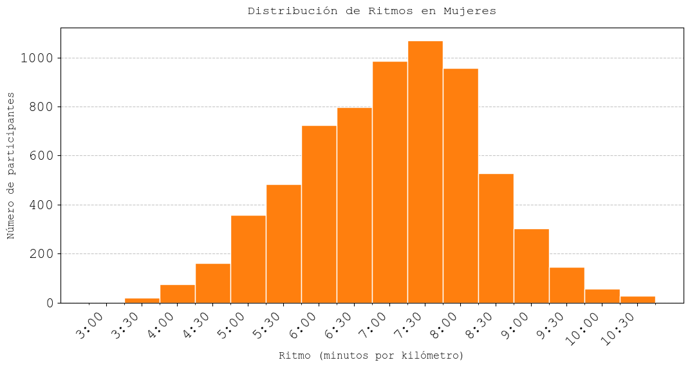
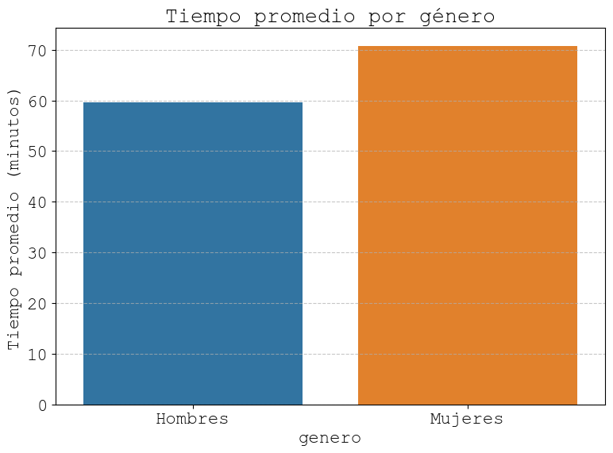

# Análisis Fiestas Mayas 2026 🏃

Análisis exploratorio de los resultados de la carrera **Fiestas Mayas 2026** (10km), 50ª edición realizada el 25 de mayo en los Bosques de Palermo, Buenos Aires. Se procesan tiempos, ritmos y distribución de participantes por género y rango de edad.

---

## Estructura del proyecto

```
Analisis-fiestas-mayas-2026/
│
├── fiestas_mayas_2026.csv          # Datos crudos de la carrera
│
├── carga_datos.py                  # Lectura, limpieza y transformación de datos
├── tablas.py                       # Consultas DuckDB y resúmenes por grupo
├── visualizaciones.py              # Gráficos con matplotlib y seaborn
│
├── imagenes/                       # Gráficos generados automáticamente
│   ├── tiempo_edad_hombres.png
│   ├── tiempo_edad_mujeres.png
│   ├── ritmos_hombres.png
│   ├── ritmos_mujeres.png
│   └── comparacion_genero.png
│
└── README.md
```

## Orden de ejecución

Los archivos deben ejecutarse en este orden, ya que cada uno depende del entorno generado por el anterior:

1. `carga_datos.py` → genera `df`, `hombres`, `mujeres`
2. `tablas.py` → genera `resumen`, `resumen_mujeres`, `resumen_genero`
3. `visualizaciones.py` → produce y guarda todos los gráficos en `imagenes/`

---

## Dependencias

```
pandas
duckdb
matplotlib
seaborn
numpy
```

Instalación:
```bash
pip install pandas duckdb matplotlib seaborn numpy
```

---

## Gráficos

### Tiempo promedio por rango de edad




### Distribución de ritmos (min/km)




### Comparación por género




## Fuente de datos

Resultados oficiales de la carrera Fiestas Mayas 2026 — Club de Corredores.